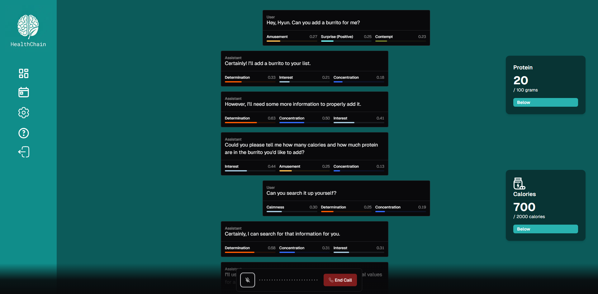

<div align="center">
  
  <h1>EVI Next.js App Router Example</h1>
</div>



# HealthChain

## Overview

This project features a sample implementation of Hume's [Empathic Voice Interface](https://hume.docs.buildwithfern.com/docs/empathic-voice-interface-evi/overview) using Hume's React SDK. Here, we have a simple EVI that uses the Next.js App Router.

## Project Local Run Instructions
```
npm install
npm run dev
```

## .env Setup
Make sure to create a .env file and fill it with the stuff from discord
```
HUME_API_KEY=
HUME_SECRET_KEY=
NEXT_PUBLIC_HUME_CONFIG_ID=

GEMINI_API_KEY=
```

## Project deployment

Click the button below to deploy this example project with Vercel:

[](https://vercel.com/new/clone?repository-url=https%3A%2F%2Fgithub.com%2Fhumeai%2Fhume-evi-next-js-starter&env=HUME_API_KEY,HUME_SECRET_KEY)

Below are the steps to completing deployment:

1. Create a Git Repository for your project.
2. Provide the required environment variables. To get your API key and Client Secret key, log into the portal and visit the [API keys page](https://beta.hume.ai/settings/keys).

## Support

If you have questions, require assistance, or wish to engage in discussions pertaining to this starter template, [please reach out to us on Discord](https://link.hume.ai/discord).


## Setting Up the Backend

To set up the backend, follow these steps:

1. **Create a Virtual Environment**:
  ```bash
  python3 -m venv venv
  ```

2. **Activate the Virtual Environment**:
  - On macOS and Linux:
    ```bash
    source venv/bin/activate
    ```
  - On Windows:
    ```bash
    .\venv\Scripts\activate
    ```

3. **Navigate to the Backend Source Directory**:
  ```bash
  cd backend/src
  ```

4. **Install dependencies**

```bash
  pip install -r requirements.txt
  ```

5. **Run the Backend Application**:
  ```bash
  python main.py
  ```

This will start the backend server, and it should be running and ready to handle requests.
